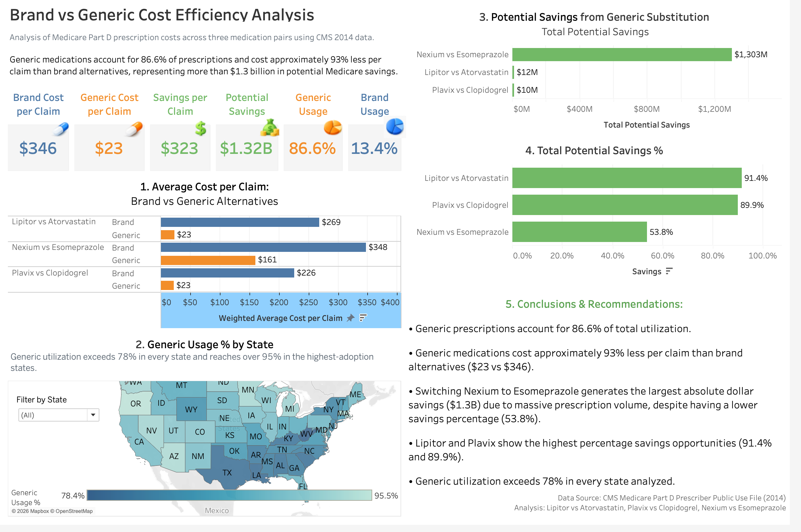

# Brand vs Generic Cost Efficiency Analysis

## Dashboard Overview

🔗 **Interactive Tableau Dashboard:**
https://public.tableau.com/views/BrandvsGenericCostEfficencyAnalysis/Dashboard1?:language=en-US&:sid=&:redirect=auth&:display_count=n&:origin=viz_share_link

---

## Business Problem

Brand-name medications often cost significantly more than generic alternatives, creating opportunities for healthcare cost optimization. This project analyzes Medicare Part D prescription data to compare utilization patterns and costs between brand-name and generic medications across U.S. states.

---

## Why These Medication Pairs?

Three widely prescribed brand-name and generic medication pairs were selected because they represent common treatments across major healthcare categories and provide meaningful opportunities for cost comparison.

* **Lipitor vs Atorvastatin** – High cholesterol treatment
* **Plavix vs Clopidogrel** – Cardiovascular and stroke prevention
* **Nexium vs Esomeprazole** – Gastrointestinal treatment

These medications were chosen because both brand and generic alternatives were widely prescribed in the Medicare Part D dataset, allowing for meaningful analysis of utilization patterns, prescription costs, and potential savings opportunities.

---

## Tools Used

* Google BigQuery
* SQL
* Tableau
* Excel

---

## Key Findings

* Generic medications accounted for **86.6%** of prescription utilization.
* Generic prescriptions cost approximately **93% less per claim** than brand-name alternatives.
* Potential savings exceeded **$1.3 billion** through increased generic substitution.
* Generic utilization exceeded **78%** in every state analyzed.

### Key Findings Visualization

---

## Business Recommendations

1. Promote generic substitution where clinically appropriate.
2. Focus on high-volume medications with the largest savings opportunities.
3. Monitor state-level prescribing patterns.
4. Support physician and patient education regarding generic alternatives.

### Recommendations Slide

---

## Project Files

* Presentation PDF
* Tableau Dashboard
* Dashboard Screenshot
* Key Findings Analysis
* Business Recommendations
* SQL Query

---

## Author

**Irina Sharapova**
Business Intelligence & Data Analyst
